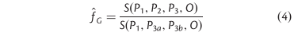

# Admixture analyses

So, let's calculate several variants of the D-statistics to infer admixture among the species in our dataset. Many of our analyses will be based on [Genomics General](https://github.com/simonhmartin/genomics_general) scripts and Simon Martin's [tutorials](https://github.com/simonhmartin/tutorials). We will also use as input file the geno file generated [previously](https://github.com/MafaldaSFerreira/hare-phylogenomics/blob/master/7.diversity_divergence_admixture/7.diversity_divergece_admixture.md#generating-the-genomics-general-input-file) for divergence and diversity statistics.

We will be calculating:
- [The minimum absolute D statistics](https://github.com/evochange/hare-phylogenomics/blob/master/8.admixture_analyses/8.admixture_analyses.md#minimum-absolute-d-statistic-dmin)(_D<sub>min</sub>_)([Malinsky et al 2018](https://www.nature.com/articles/s41559-018-0717-x));
- [The 'f-branch' statistics](https://github.com/evochange/hare-phylogenomics/blob/master/8.admixture_analyses/8.admixture_analyses.md#f-branch-statistics-fbc)(_f<sub>b</sub>(C)_) ([Malinsky et al 2018](https://www.nature.com/articles/s41559-018-0717-x));
- [A variation of admixture proportion](https://github.com/evochange/hare-phylogenomics/blob/master/8.admixture_analyses/8.admixture_analyses.md#variation-of-admixture-proportion-fhom) (_f<sub>hom</sub>_)([Martin et al 2015](https://doi.org/10.1093/molbev/msu269));
- [The franction of admixture](https://github.com/evochange/hare-phylogenomics/blob/master/8.admixture_analyses/8.admixture_analyses.md#scans-of-fraction-of-admixture-fd-and-detection-of-ancestral-introgression) (_f<sub>d</sub>_) in windows ([Martin et al 2015](https://doi.org/10.1093/molbev/msu269));

## Minimum absolute D-statistic (_D<sub>min</sub>_)

To calculate _D<sub>min</sub>_, you need to calculate D-statistic (or ABBA-BABA) for the three possible conformations of a trio of taxa. I.e,:

- ((taxa1,taxa2),taxa3);
- ((taxa1,taxa3),taxa2);
- ((taxa2,taxa3),taxa2);

_D<sub>min</sub>_ will be the smallest value of D among the three calculated values. The assumption is that the conformation that represents the true relationship between the three species will result in the lowest (and non-significant) D-statistic. With hybridization and particularly with ancestral hybridization it is possible that even the lowest D is relatively high and significant.

So, the first step of the _D<sub>min</sub>_ analysis is to generate all necessary ABBA-BABA conformations from our set of species and calculate D-statistics for all of them. To do so, I used R package [treeman](https://github.com/DomBennett/treeman) which reads all taxa from our ASTRAL species tree, and the R package [gtools](https://cran.r-project.org/web/packages/gtools/index.html), which has a `combinations()` function that generates combinations of whatever size from a list. 

```
Rscript generate_Dmin_combinations.R
```

The output of this script is called `species_combinations_Dmin.txt` and will have three columns corresponding to the various combinations of taxa.

| Column1 | Column2 | Column3 | 
| - | - | - |
| taxa1 | taxa2 | taxa3 |
| taxa1 | taxa3 | taxa2 |
| taxa2 | taxa3 | taxa1 |

In parallel, let's calculate allelic frequencies for all the species in our dataset using `freq.py` from Genomics General (following [Simon Martin's tutorial](https://github.com/simonhmartin/tutorials/tree/master/ABBA_BABA_whole_genome)). As input, we use the whole-genome geno file generated [previously](https://github.com/evochange/hare-phylogenomics/blob/master/7.diversity_divergence_admixture/7.diversity_divergece_admixture.md#generating-the-genomics-general-input-file) and a `species_file.txt` that assigns individuals to species. It is important to set `--target derived` and use the outgroup species as the last population (in our case `-p ORY`). This ensures all allele frequencies are derived respectively to the outgroup.

```
python ~/my_programs/genomics_general/freq.py -g wg_filtered_wHead.geno.gz -p L_americanus -p L_californicus -p L_callotis -p L_capensis -p L_corsicanus -p L_castroviejoi -p L_europaeus -p L_fagani -p L_granatensis -p L_habessinicus -p L_mandschuricus -p L_starki -p L_othus -p L_timidus -p L_townsendii -p ORY --popsFile species_file.txt --target derived -f diplo -o by_species_wg_filtered_wgHead.freq.tsv.gz
```

Based on the code on Simon Martin's tutorial, I wrote my own Rscrip `D-stat.R` to calculate ABBA-BABA for each trio. This script requires the script `jackknife.R` from [Genomics General]((https://github.com/simonhmartin/genomics_general)) to calculate Z-scores for each calculation of D. 

Loop through `species_combinations_Dmin.txt`, feeding the species names to the script, like so:

```
while read -r taxa1 taxa2 taxa3; do Rscript D-stat.R by_species_wg_filtered_wgHead.freq.tsv.gz D_stat_output_by_species/$taxa1_$taxa2_$taxa3.out $taxa1 $taxa2 $taxa3; done < species_combinations_Dmin.txt
```

Concatenate the resulting files:

```
tail -q -n1 *.out > D_stat_by_species_results.txt
```

Finally, the code in `calculate_Dmin.R` will use `D_stat_by_species_results.txt` and `species_combinations_Dmin.txt` to calculate the smallest _D<sub>min</sub>_ value for each trio. The output will be `Dmin_by_species_sig_FINAL.txt`.

## "f-branch" statistics (_f<sub>b</sub>(C)_)

**Disclaimer** Since I wrote this code and finalized the results for publication, "f-branch" has been implemented in [Dsuite](https://github.com/millanek/Dsuite) which is probably much easier to use (I've never tried it). 

The "f-branch" statistics is a measure of admixture proportion (_f<sub>G</sub>_; [Martin et al 2015](https://doi.org/10.1093/molbev/msu269)) that takes into account the phylogenetic relationship among species provided in a species tree. Taking the species tree into account is important because the family of D-statistics is prone to false positives when ancestral hybridization or hybridization among closely related species occurs.
"f-branch" also has the advantage of calculating a measure of admixture proportion among ancestral branches of a species tree, being thus able to detect ancestral hybridization. 

To calculate "f-branch" between a given branch _b_ and branch _C_, we will need to calculate admixture proportion for all combinations f(A,B,C,O) where _A_ are all leaves below branch _a_ (sister to _b_), _B_ are the leaves bellow branch _b_, and _C_ is the donor taxa. When we have all f(A,B,C,O) values we calculate (C). For a given node _b_, for each _A_ leaf below _a_ (sister of _b_) we note down the minimum f(A,B,C,O) over all _B_ leaves below _b_ (call it fb(A,C)). Then, we calculate the median of the fb(A,C) over all _A_.

Take this simple example:

(((A1,A2)a,(B1,B2)b)C)O);

where branches _a_ and _b_ have two daughter lineages _A1_ and _A2_, and _B1_ and _B2_, respectively. This table would represent the total f(A,B,C,O) to calculate:

| a | b | C | O | f |
|-|-|-|-|-|
| A1 | B1 | C | O | 0.01 | --> min
| A1 | B2 | C | O | 0.02 |
| A2 | B1 | C | O | 0.03 |
| A2 | B2 | C | O | 0.02 | --> min

For A1 and A2, we would determine which f is smaller (B1 or B2). For A1 this would be f(A1,B1,C,O) and for A2 this would be f(A2,B2,C,O). We store both these values which would result in the following table:

| a | b | C | O | f | 
|-|-|-|-|-|
| A1 | B1 | C | O | 0.01 | --> min
| A2 | B2 | C | O | 0.02 | --> min

To calculate (C), we take the median across the f(A1,B1,C,O) and f(A2,B2,C,O).

### Generate all f(A,B,C,O) taxa combinations from a species tree.
With a larger tree, it gets more complicated. I wrote `fd_tree_calculations.R` to obtain all pairs of _b_ and _C_ determined by the species tree and all f(A,B,C,O) combinations these pairs generate. This script will read in the ASTRAL species tree and use the R packages `treeman`, `ape` and `purr` to generate a table `fb_C_comparisonst_f_G.txt` of this format:

| | | | | |
|-|-|-|-|-|
| b | a | B | A | C |

### Admixture proportion (_f<sub>G</sub>_ from [Martin et al 2015](https://doi.org/10.1093/molbev/msu269))
Now that we have all f(A,B,C,O) combinations, we need to actually calculate them. The statistic that needs to be calculated for each combination is admixture proportion (_f<sub>G</sub>_). [Martin et al 2015](https://doi.org/10.1093/molbev/msu269) explains really the reasoning behind this statistic and how to calculate it, so I won't go into much detail. Equation (4) in this paper is the formula to calculate _f<sub>G</sub>_:



We need to split the P3 (or taxa C) sample in P3a (or Ca) and P3b (or Cb) to calculate the denominator of _f<sub>G</sub>_. Since most of the species are represented by two individuals, this means I used one individual as P3a and another as P3b. There are two exceptions. _L. americanus_ has 4 individuals and _L. timidus_ has 3 individuals, so I split them in two "populations". _L. callotis_ has only one individual, so I  randomly phased its two chromosomes and use each one as Ca and Cb.

In excel, I completed `fb_C_comparisonst_f_G.txt` with two extra columns detailing which individual per species C I was going to use as Ca and Cb.

| | | | | | | |
|-|-|-|-|-|-|-|
| b | a | B | A | C | Ca | Cb | 

Using `Genomics General`'s `freq.py`, I calculated the frequencies by individual, for the two populations of _L. americanus_ and _L. timidus_, and for the two chromosomes of _L. callotis_.

By individual:
```
python ~/my_programs/genomics_general/freq.py -g wg_filtered_wHead.geno.gz -p LAM_A0604_WA -p LAM_A0965_WA -p LAM_Allab3_Bo -p LAM_NBerg67_Rockies -p LCF_CAL_1954 -p LCF_TUC_2060 -p LCL_1956 -p LCP_SAF_1903 -p LCP_TAN_3023 -p LCR_ITA_1957 -p LCR_ITA_1958 -p LCS_1891 -p LCS_1894 -p LER_PYR_1546 -p LER_VIE_1639 -p LFG_FAG114 -p LFG_FAG96 -p LGR_CRE_2553 -p LGR_SEV_1163 -p LGR_SOR_1184 -p LHB_HAB35 -p LHB_HAB68 -p LMS_PRI_2460 -p LMS_PRI_2461 -p LST_STA65 -p LST_STA89 -p LOT_2109 -p LOT_2110 -p LTM_AFR_3108 -p LTM_CAT_2012 -p LTM_MAG_1862 -p LTW_JRRK_3 -p LTW_MTA_3280 -p OryCun --popsFile individuals_file.txt --target derived -f diplo -o by_individual_wg_filtered_wgHead.freq.tsv.gz
```

For _L. americanus_ and _L. timidus_:
```
python ~/my_programs/genomics_general/freq.py -g wg_filtered_wHead.geno.gz -p L_americanus_1 -p L_americanus_2 -p L_timidus_1 -p L_timidus_2 -p OryCun --popsFile species_file_f_G.txt --target derived -f diplo -o by_species_fg_wg_filtered_wgHead.freq.tsv.gz
```

For _L. callotis_, I split the diploid entries into two haploid samples using `make_haploid_geno.py` (uses python packages `pandas` and `random`). The first file is the input and second file is the output file name.

```
make_haploid_geno.py wg_filtered_wHead.geno.gz wg_filtered_wHead_hap.geno.gz
```

Then I calculated frequencies for _L. callotis_.

```
python ~/my_programs/genomics_general/freq.py -g wg_filtered_wHead_hap.geno.gz -p LCL_1956_A -p LCL_1956_B -p OryCun --popsFile chromosome_populations.txt --target derived -f diplo -o by_chr_LCL_wg_filtered_wgHead.freq.tsv.gz
```

I collapsed `by_species_wg_filtered_wgHead.freq.tsv.gz`, `by_individual_wg_filtered_wgHead.freq.tsv.gz`, `by_species_fg_wg_filtered_wgHead.freq.tsv.gz` and `by_chr_LCL_wg_filtered_wgHead.freq.tsv.gz` into a single table `all_frequencies_filtered.freq.tsv` using the following R code:

```
library(data.table)

# Read the allele-frequencies table.
freq_table_species=read.table("by_species_wg_filtered_wgHead.freq.tsv",header=T,as.is=T)
freq_table_indv=read.table("by_individual_wg_filtered_wgHead.freq.tsv",header=T,as.is=T)
freq_table_extra=read.table("by_species_fg_wg_filtered_wgHead.freq.tsv",header=T,as.is=T)
freq_table_LCL=read.table("by_chr_LCL_wg_filtered_wgHead.freq.tsv",header=T,as.is=T)

#remove granatensis
# remove oryctolagus from the other tables
freq_table_indv$OryCun<-NULL
freq_table_extra$ORY<-NULL
freq_table_LCL$OryCun<-NULL
# Convert to data.table
freq_table_species<-data.table(freq_table_species)
freq_table_indv<-data.table(freq_table_indv)
freq_table_extra<-data.table(freq_table_extra)
freq_table_LCL<-data.table(freq_table_LCL)

## use all=T to fill non-existent cells with NaN
merge(freq_table_species,freq_table_indv,by=c("scaffold","position"),all=T)->freq_table_1
merge(freq_table_1,freq_table_extra,by=c("scaffold","position"),all=T)->freq_table_2
merge(freq_table_2,freq_table_LCL,by=c("scaffold","position"),all=T)->freq_table

write.table(freq_table,file="all_frequencies_filtered.freq.tsv",col.names=T,quote=F,sep="\t",row.names = F)
```

### Actually calculating _f<sub>b</sub>(C)_
Now, I used the code in `f_G.R` to calculate _f<sub>G</sub>_ for all combinations in `fb_C_comparisons_f_G.txt`. Note that the order on this file is B, A, C, Ca, Cb, and this is the order in wich to specify taxa to `f_G.R`. 

```
Rscript f_G.R input.freq.tsv.gz outfile.tsv b a B A C Ca Cb
```

The script will rearange them in the correct order for ABBA-BABA calculations. It requires R packages `data.table` and `stringi`. It also requires `jackknife.R` from `Genomics General`. It has a specific jackkniffing strategy for our pseudo-phased _L. callotis_, where each jackkniffing round, both genotypes in a given position will be randomly shuffled. This aims to avoid any biases caused when we split the two chromosomes to obtain two pseudo-samples for L. callotis. 

```
while read -r value1 value2 value3 value4 value5 value6 value7; do Rscript f_G.R all_frequencies_filtered.freq.tsv.gz outfile_ame $value1 $value2 $value3 $value4 $value5 $value6 $value7; done < fb_C_comparisons_f_G.txt
```

The output will be a table with the following entries:

| | | | | | | | | | | | |
|-|-|-|-|-|-|-|-|-|-|-|-|
| b | a | A | B | C | Ca | Cb | fG | no. blocks | no. positions | standard deviation | Z-score |

Concatenate all output files into a single table `fG_results_species.txt` with no headers and run the following code to compute _f<sub>b</sub>(C)_. Use the code in `fb_C.R` to calculate all values for the _b_ _C_ pairs designated in `fb_C_comparisons_f_G.txt` as explained at the beginning of this section. The script will read both of these files and requires R packages `data.table`, `reshape2` and `gplots` (if you want to plot a heatmap with the values).

## Variation of admixture proportion (_f<sub>hom</sub>_)

_f<sub>hom</sub>_ is calculated very similarly to _f<sub>G</sub>_, where the only difference is that we don't split C in Ca and Cb, but rather use C twice. You can use the `f_G.R` to calculate `f_hom.R` by giving it a repeated entry for `Ca` (or `P3a`) and `Cb`(or `P3b`). For example, this configuration would calculate _f<sub>hom</sub>_:

```
Rscript f_G.R input.freq.tsv.gz outfile.tsv b a B A C C C
```

The command I used for the calculations in the paper is this:
```
Rscript ./f_G.R all_frequencies_filtered.freq.tsv.gz LAM_Allab3_Bo-LAM_A0604_WA-LCF_CAL_1954_fhom.out LAM_A0604_WA LAM_Allab3_Bo LAM_A0604_WA LAM_Allab3_Bo LCF_CAL_1954 LCF_CAL_1954 LCF_CAL_1954
```

## Scans of fraction of admixture (_f<sub>d</sub>_) and detection of ancestral introgression

We estimated the fraction of admixture across 50 kb genomic sliding windows (>100 sites, 5 kb steps) using `ABBABABAwindows.py` from `Genomics General`. Here the calculation is pretty simple, as we can calculate this directly. I used the geno file generated [here](https://github.com/evochange/hare-phylogenomics/blob/master/7.diversity_divergence_admixture/7.diversity_divergece_admixture.md#generating-the-genomics-general-input-file). The command that I used was this one:

```
python ~/my_programs/genomics_general/ABBABABAwindows.py -g wg_filtered_wHead.geno.gz -o L_townsendii_vs_Lamericanus_fdscan_50k5k.txt -P1 L_granatensis -P2 L_townsendii -P3 L_americanus -O ORY --popsFile species_file.txt -f diplo -w 50000 --windType coordinate --minSites 100 --stepSize 5000 -T 2
```

The objective of this scan was to detect windows that had introgressed between _L. americanus_ and three other species: _L. timidus_, _L. othus_ and _L. townsendii_. We thus performed three independent scans for each of the three species pairs. We considered windows in the top 0.5% _f<sub>d</sub>_ distribution to be significantly introgressed. Finally, we considered outlier in all three scans as regions that were potentially shared among the ancestrals of _L. americanus_ and _L. timidus_, _L. othus_ and _L. townsendii_. The code that I used to process the `ABBABABAwindows.py` output for the three scans and compare them across the three species is documented in `ancestral_outlier_windows.R`. This script uses `dplyr`, `scales`, and `biomaRt` (to annotate the outlier windows).

To calculate dxy for each of the outlier windows, we simply run `popgenWindows.py` using the same species and window size configuration (50 kb, 5 kb step). We later filtered windows from the output with less than 2000 sites.

```
python ~/my_programs/genomics_general/popgenWindows.py -T 10 -g wg_filtered_wHead.geno.gz -o dxy_windows50k_sscc.out -p L_americanus -p L_timidus -p L_othus -p L_townsendii --popsFile species_file.txt -f diplo -w 50000 --stepSize 5000 --minSites 100 --windType coordinate
```